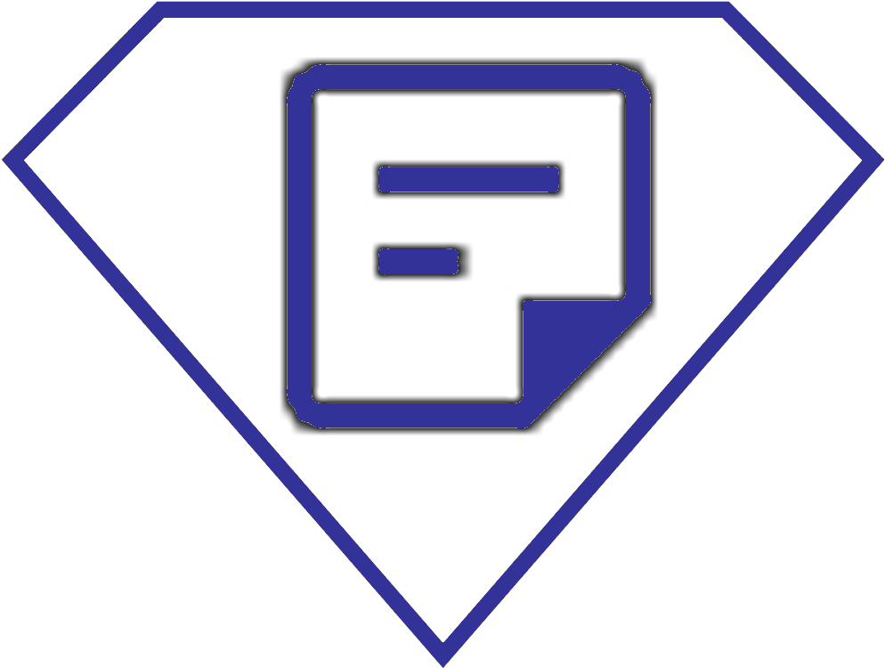
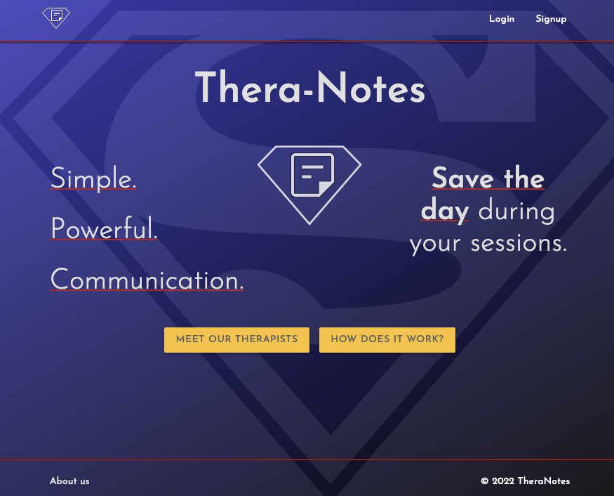
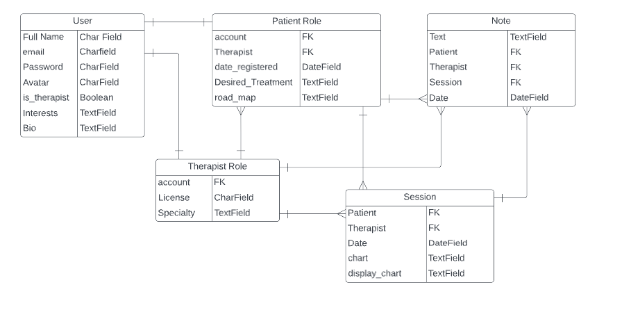
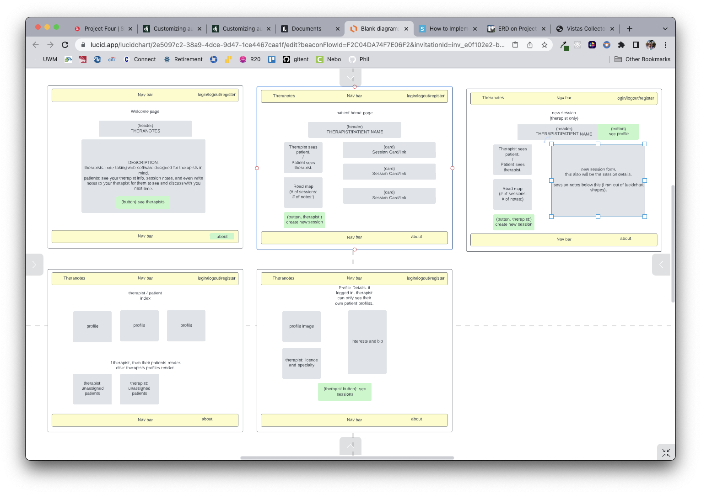

<h1 align="center">Thera-Notes</h1>

    

<h3 align="center">Save the day in your therapy sessions</h3>

    Thera-Notes is a unique note taking app designed for the therapist and their patient, with the end goal to help open the dialogue between sessions. So much can happen in one session, and it's sometimes difficult to remember it all. With Thera-Notes, you don't have to.

We are here to help save your sessions.

<h2>THERAPIST FEATURES</h2>
<ul style="list-style-type: square;">
<li>Security. Sign up as a Therapist and assign your patients to your caseload. Only you can see your own patients.</li>    
<li>Create sessions for your patients and chart on the important items. There are two fields: a chart for your eyes only, and a patient-readable chart for them to see.</li>    
<li>See your patient's saved sessions at their home page.</li>    
<li>See the session details, and create notes for your patient to see while you're waiting for the next session.</li>    
<li>Want to add something? Edit the patient-readable chart for your client to see what's new.</li>    
<li>Satisfied with the progress your client has made? Write them a note for them to see before your next session!</li>    
<li>Sign up as a Patient and see who your therapist is and their profile. Checkout your home page and see your saved sessions. </li>    
</ul>
<h2>PATIENT FEATURES</h2>
<ul style="list-style-type: square;">
<li>Security again: Sign up as a patient and know that your identity is only known to your therapist.</li>    
<li>See your therapist's profile, and any other therapists who may be part of the network!</li>    
<li>A home page for you, to see your saved sessions, and the progress you've made.</li>    
<li>See each session's details. Add a note to your therapist for them to see before your next session! </li>   
</ul>

<h2>GETTING STARTED</h2>

    <a href="https://thera-notes.herokuapp.com/">Visit the website!</a>

<h2>TECHNOLOGIES USED</h2>

    
    
    
    
    
    
    
    

<h2>ICE BOX</h2>

<ul style="list-style-type: square;">
<li>ROAD MAP: Therapists will have the option to create and edit a Road Map.
A birds-eye view for the patient to see the overall plan for their sessions.</li>
<li>USER PHOTOS: Coming soon! Users will be able to upload a photo of their own to use as their avatar</li>
<li>PROFILE CUSTOMIZATION: Coming soon! Users will be able to edit their information.</li>
</ul>

<h2>PLANNING</h2>
<h4>(For the curious developer)</h4>

This project is a full-stack Python-Django application that utilizes PostgreSQL, with some HTML, CSS, and Materialize!

